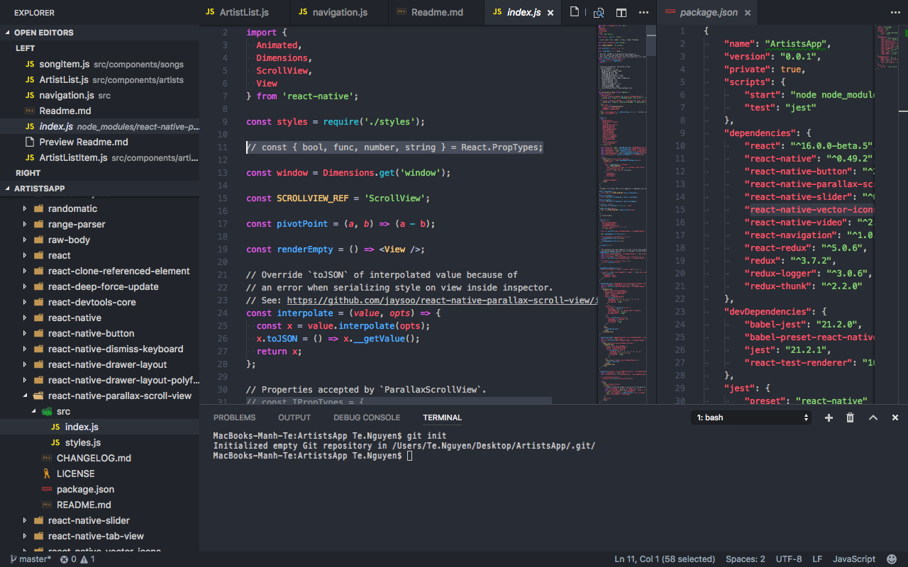

# Đồ án môn IOS
- Để cài đặt chương trình bạn cần.
```bash
git clone https://github.com/my0sot1s/music-app.git
cd music-app
npm install 
```
- Sau đó tiến hành link 2 thư viện.

```bash

react-native link react-native-video

react-native link react-native-vector-icons

```

- Tiếp đến tiến hành sửa thư viện trước khi build.

* Tiến hành fix lỗi của parallax scrollview.

## edit

- Tiến hành vào node_modules vào thư mục react-native-parallax-scroll-view/src/index.js
comment các dòng sau:
```js
const { bool, func, number, string } = React.PropTypes;

Properties accepted by `ParallaxScrollView`.
const IPropTypes = {
  backgroundColor: string,
  backgroundScrollSpeed: number,
  fadeOutForeground: bool,
  fadeOutBackground: bool,
  contentBackgroundColor: string,
  onChangeHeaderVisibility: func,
  parallaxHeaderHeight: number.isRequired,
  renderBackground: func,
  renderFixedHeader: func,
  renderForeground: func,
  renderScrollComponent: func,
  renderStickyHeader: func,
  stickyHeaderHeight: number,
  contentContainerStyle: View.propTypes.style
};

ParallaxScrollView.propTypes = IPropTypes;
```



- Sau đó chạy dòng để run app.
```bash
react-native run-ios
```
